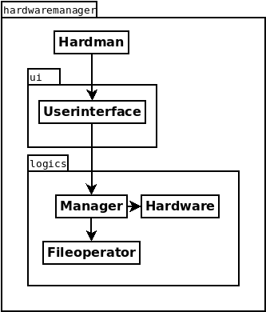

## Arkkitehtuurikuvaus

  
Hardman on ohjelman pääluokka, joka käynnistää käyttöliittymän.  
Käyttöliittymästä vastaa täysin ui-pakkauksen luokka Userinterface, jonne käyttöliittymä on eriytetty. Käyttöliittymäluokassa on pyritty vähentämään toisteinen koodi minimiin eriyttämällä uudelleenkäytettävät toiminnallisuuden omiksi metodeiksensa. Käyttöliittymä kommunikoi ainoastaan logics-pakkauksen Manager-luokan kanssa.  
  
Ohjelman päätoiminnallisuuden sekä kirjanpidon tarjoaa Manager-luokka, joka vastaa komponenttilistan ylläpidosta ja manipuloinnista. Tietokonekomponentteja kuvaa luokka Hardware, jolla ei ole varsinaista toiminnallisuutta ns. perus gettereiden ja settereiden lisäksi. Tiedostojen luku- ja kirjoitusoperaatiot kulkevat Manager-luokan kautta ja niistä vastaava luokka on Fileoperator.  
  
Fileoperator -luokka koostu kahdesta metodista, joista toinen kirjoittaa tiedostoon ja toinen lukee tiedostosta. 
  
Ohjelma tallentaa komponentit tiedostoon riveittäin muodossa `nimi;tyyppi;sijainti`. Tiedostojen tyyppi on .hwm, jota käytetään automaattisesti tiedosto-operaatioista vastaavissa metodeissa. Itse tiedostonimet ovat muutoin käyttäjän syöttein määriteltävissä.
  
Tiedosto voidaan syöttää ohjelmalle myös käynnistyksen yhteydessä parametrina, jolloin se avataan (mikäli mahdollista) automaattisesti. Hardman -luokka tarkistaa käynnistyksen yhteydessä onko parametreja annettu. Mikäli on, annetaan se syötteenä Userinterface-luokan automaattilatausmetodille, jonka toiminnallisuus vastaa muutoin tiedoston manuaalista avausta. 
  
---
Sekvenssikaavioesimerkki käyttäjän lisätessä komponentin järjestelmään:  
  

