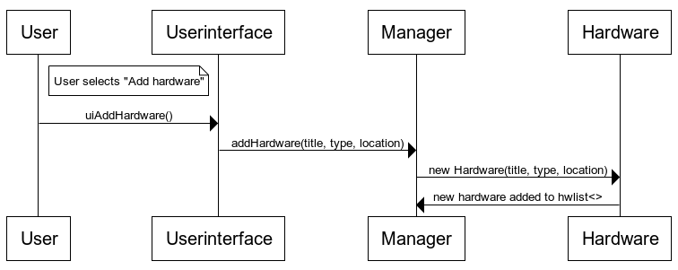

## Alustava arkkitehtuurikuvaus

  
Hardman on ohjelman pääluokka, joka käynnistää käyttöliittymän. Ohjelman päätoiminnallisuuden sekä kirjanpidon tarjoaa Manager-luokka ja Hardware-luokka kuvaa komponenttia tai oheislaitetta. 
  
---
Sekvenssikaavioesimerkki käyttäjän lisätessä komponentin järjestelmään:  
  

