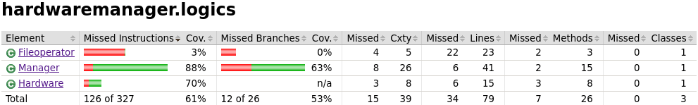

# Testausdokumentti
Sovellus sisältää automatisoituja JUnit -yksikkötestejä sekä sitä on myös testattu melko paljon manuaalisesti minkä perusteella on lisätty erilaisia syötteiden tarkistuksia virhetilanteiden minimoimiseksi. Sovellustoiminnallisuuden ydin, Manager-luokka, omaa 88% rivikattavuuden. Fileoperator-luokkaa on testattu vain manuaalisesti, mistä johtuen logics-pakkauksen testien kokonaiskattavuus ei saavuta aivan täysin tavoitetasoa. 

